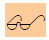

 <b>10 février 2014</b>

Le Législateur a prolongé une dernière fois les délais offerts aux copropriétés pour se mettre en règle avec leurs obligations de l'article 577-4 §1 et 577-5 §2 du Code Civil.  

Le syndic précédent avait confié au Cabinet Arquin de préparer un projet de statuts conforme à la législation. Toutefois, ce projet est parvenu après les décisions de l'AG du 30.04.2013 de [**ne pas créer d'association partielle**](http://brab80.webs.com/PV_AG_2013_plus4mois.pdf).  

Après de multiples contacts avec le [Syndicat National des Propriétaires et Copropriétaires](http://www.snpc-nems.be) (SNPC), une invitation a été lancée auprès de quelques copropriétaires pour constituer un "Groupe des Sages", destiné à passer en revue  
les travaux du Cabinet Arquin, et de faire une proposition de statuts conformes auprès de l'Assemblée Générale. (Note : une révision des statuts nécessite l'organisation d'une Assemblée Générale extraordinaire)  
Le "Groupe des Sages" s'est constitué le 01.01.2014\. Il a été formé des personnes suivantes (par ordre alphabétique) :  
&nbsp;&nbsp;&nbsp;&nbsp;Robert DUMOULIN (`*`)  
&nbsp;&nbsp;&nbsp;&nbsp;Michel GUILLAUME  
&nbsp;&nbsp;&nbsp;&nbsp;Olivier HAMAL (Président du SNPC)  
&nbsp;&nbsp;&nbsp;&nbsp;Montserrat MARTIN MORENO (`*`)  
&nbsp;&nbsp;&nbsp;&nbsp;Marianne PALAMIDES (SNPC)  
&nbsp;&nbsp;&nbsp;&nbsp;Guy SMITS (`*`)  
&nbsp;&nbsp;&nbsp;&nbsp;David WEYTSMAN.  
Une réunion a été organisée le 30.01.2014 avec (`*`) comme participants.  

Voici le résultat des travaux du "Groupe des Sages" :  
&nbsp;&nbsp;&nbsp;&nbsp;[détail](http://brab80.webs.com/Modifs_Arquin&Grp20140130.pdf) des modifications discutées ;  
&nbsp;&nbsp;&nbsp;&nbsp;[**texte des statuts**](Statuts_Conformes.pdf) en résultant.

|  |  |
| --- | --- |
| l'article est nouveau, sur recommandation du Cabinet Arquin | l'article a été modifié par le Cabinet Arquin et/ou par le "Groupe des Sages" |

