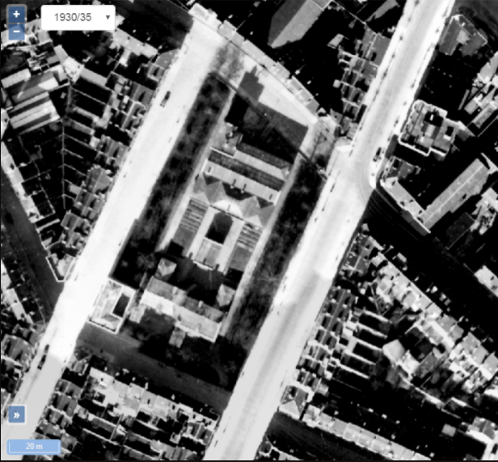
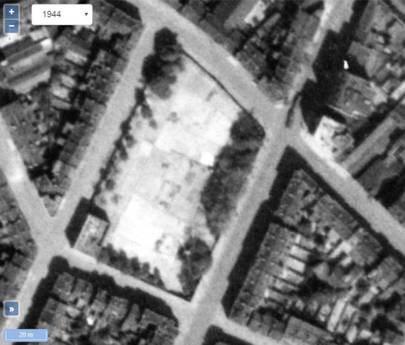
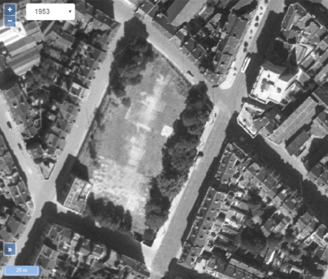

<link rel="stylesheet" href="normal3.css" type="text/css" />

# 1930

Un immeuble de gestion des cimetières des communes environnantes (Bruxelles, Schaerbeek et Etterbeek)

# 1944

Suite à des bombardements, il ne reste plus que des traces de l'ancien immeuble de gestion.

# 1953

Peu avant la construction de l'immeuble, on observe que les traces de l'immeuble des années '30 sont orientées perpendiculairement aux trois blocs de l'actuel "*Complexe Brabançonne*"

