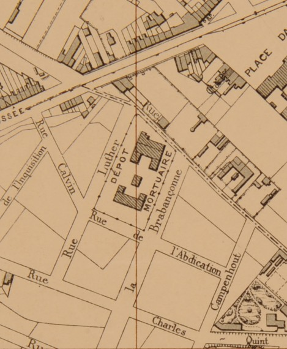

<link rel="stylesheet" href="normal3.css" type="text/css" />

# 1893-1895

Un dépôt de corbillards est construit à l'entrée nord-est du vaste cimetière préexistant depuis (sans doute) plusieurs siècles.

# 1930

L'immeuble de gestion des cimetières des communes environnantes (Bruxelles, Schaerbeek et Etterbeek) est bordé d'arbres.  
Au coin des rues de l'Abdication et Luther est implantée une sous-station d'électricité. 

# 1944

Sans doute à la suite de bombardements, il ne reste plus que des traces de l'ancien immeuble de gestion.  
Par contre, la sous-station d'électricité reste debout.

# 1953

Peu avant la construction de l'immeuble, on observe que les traces de l'immeuble rasé demeurent visibles.  
Elles sont orientées perpendiculairement par rapport à l'alignement des trois blocs de l'actuel "*Complexe Brabançonne*"

