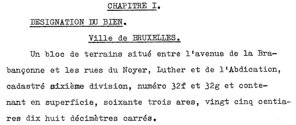
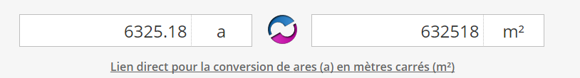
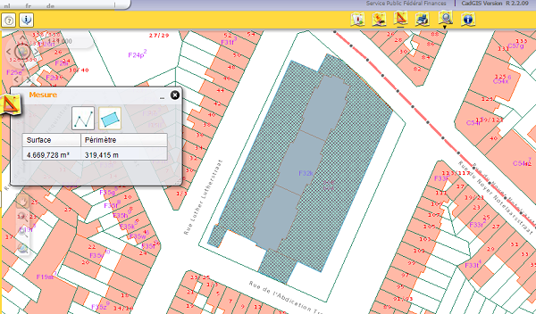

<link rel="stylesheet" href="normal3.css" type="text/css" />

# Données cadastrales

Comme consigné dans les trois actes successifs des 27.07.1955, 17.11.1955 et 16.11.1956 déposés par la Société Anonyme des Habitations à Bon Marché de l'Agglomération Bruxelloise (SAHBMAB),

* [la Ville de Bruxelles détenait un terrain](bruciel.md) compris entre l'avenue de la Brabançonne et les rues du Noyer, Luther et de l'Abdication, sur lequel était érigé :
    *  un immeuble de gestion des cimetières des communes environnantes (Bruxelles, Schaerbeek et Etterbeek) ;
    * une sous-station d'électricité
* la SAHBMAB a été constituée en société le 14.03.1900 ;
* la SHBMAB a acquis le terrain de  la Ville de Bruxelles le 13.10.1950 

### Dimensions hors tout de la parcelle

  

> Il s'agissait de l'<b>espace maximal disponible</b> pour toutes les constructions que la SAHBMAB était autorisée à ériger.

### Surfaces aménagées par la SAHBMAB {bâtiment + pelouses et haies}

Le périmètre de mesure fourni par le [site du cadastre](http://www.cadastre.be/Belgique/Bruxelles_Capitale/Bruxelles) (SPF Finances) limite la surface à quelque 4.670 m2.

> Raison de cette différence : la parcelle enregistrée en 1950 au cadastre s'étendait en fait jusqu'à la moitié de la largeur des quatre chaussées.

### Surface du bâtiment d'habitation

Les distances de mesure fournies par le site du cadastre, indiquent que, pour le <b>bâtiment proprement dit</b> :

* la longueur est de 85 m ;
* la largeur est de 16,5 m,

soit une surface approximative légèrement supérieure à 1.400 m2.

