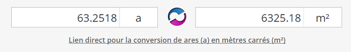

<link rel="stylesheet" href="normal3.css" type="text/css" />

# Données cadastrales

Comme consigné dans les trois actes successifs des 27.07.1955, 17.11.1955 et 16.11.1956 déposés par la Société Anonyme des Habitations à Bon Marché de l'Agglomération Bruxelloise (SAHBMAB),

* [la Ville de Bruxelles détenait un terrain](bruciel.md) compris entre l'avenue de la Brabançonne et les rues du Noyer, Luther et de l'Abdication, sur lequel était érigé :
    *  un immeuble de gestion des cimetières des communes environnantes (Bruxelles, Schaerbeek et Etterbeek) ;
    * une sous-station d'électricité
* la SAHBMAB a été constituée en société le 14.03.1900 ;
* la SHBMAAB a acquis le terrain de  la Ville de Bruxelles le 13.10.1950 

### Dimensions hors tout de la parcelle

  

> Il s'agissait de l'espace disponible pour toutes les constructions que la SAHBMAB était autorisée à ériger.
