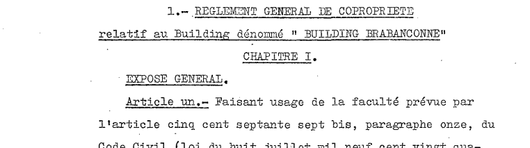

<link rel="stylesheet" href="normal4.css" type="text/css" />

# Règlement de copropriété

Les pages 144 et suivantes de l'Acte de Base remis à tout acheteur d'un appartement après le 27.07.1955 (puis, à partir du 17.11.1956, à l'acheteur d'un emplacement destiné au stationnement d'une voiture) comportent des dispositions qui relèvent du titre suivant :

1. ces dispositions déterminent le fonctionnement de l'Assemblée Générale, le rôle du gérant (= syndic) et le rôle du conseil de gérance (= conseil de copropriété)
    * toutefois, depuis le 01.09.2010 (Loi du 02.06.2010), toutes les dispositions du règlement de copropriété qui n'y seraient pas conformes sont de plein droit remplacées par les articles 577-3 à 577-13/1 du Code Civil
2. le règlement de copropriété guide le syndic, sous le contrôle du Commissaire aux comptes (art. 577-8/2 du Code Civil) lors de l'inventaire (art. 7 de l'[AR du 12.07.2012](http://brab80.webs.com/Loi_PCMN.pdf)),  pour assurer la réparition comptable correcte
    * ... des dépenses correspondant à des charges fixes (ex. : assurances, salaire du concierge, honoraires du syndic, frais bancaires, dossiers de sinistres, ...)
    * ... des dépenses rendues nécesaires par l'entretien ou la réparation des parties communes générales (ex. jardins, ramonage, ...)
    * ... des dépenses effectuées au profit des parties communes spéciales des appartements (ex. : combustibles de chauffage, ascenseurs, nettoyage des halls, ...) et des unités de parking (ex. : portes d'entrées, électricité, ...)
    * ... des factures qui lui sont parvenues, mais dont la prise en charge relève de copropriétaires individuels (ex. : frais notariaux, plaquettes, ...)
3. le règlement de copropriété distingue certaines parties qui sont de toute façon "communes générales" (art. 7) d'autres, réputées "spéciales à un groupe" (art. 8), tout en spécifiant que l'utilité (= à qui profite la dépense ?) est le critère à appliquer en cas de doute
    * le Juge de Paix a longuement élaboré à propos du critère d'utilité dans les attendus de sa [décision du 27.05.2016](JP_Bxl_20160527.pdf)

| Dans le cas de la Brabançonne | &nbsp; |
| --- | --- |
| **Pour les appartements** | **Pour les garages** |
| les étages `-1` à `12`   | (de manière générale) ce qui est à l'étage `-2` (2 niveaux  x 2 ailes ["*Brabançonne*" et "*Luther*"]) |
| les portes et halls d'entrée  | les portes et rampes d'accès |
| les ascenseurs  | les allées des garages (elles servent de dégagement) |
| la chaufferie  | les escaliers menant à la première porte en direction des ascenseurs `-2` |
| les locaux où se trouvent les compteurs de gaz  | &nbsp; |
| les caves et l'espace situé après la première porte en venant des ascenseurs `-2`  | &nbsp; |

