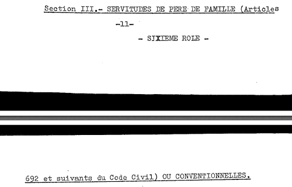
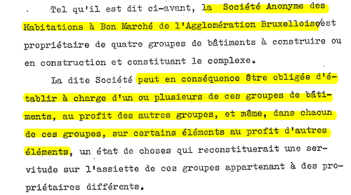
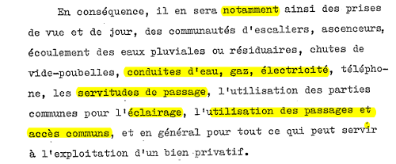

<link rel="stylesheet" href="normal4.css" type="text/css" />
<link rel="stylesheet" href="normal3.css" type="text/css" />

# La notion de servitude

L'article 682 du Code Civil prévoit ce qui suit :

*Le propriétaire dont le fonds est enclavé parce qu'il n'a aucune issue ou qu'il n'a qu'une issue insuffisante sur la voie publique, qui ne peut être aménagée sans frais ou inconvénients excessifs, peut réclamer un passage sur le fonds de ses voisins pour l'utilisation normale de sa propriété d'après sa destination, moyennant paiement d'une indemnité proportionnée au dommage qu’il peut occasionner.*

| Dans le cas de la Brabançonne |
| --- |
| Diverses servitudes sont établies explicitement dans l'Acte de Base |

### Jurisprudence

Suite à un arrêt de la Cour de Cassation du 14.10.1970, "*Même si le texte de l'article 682 du Code Civil ne le prévoit pas expressément, la servitude de passage peut concerner le sous-sol du fonds servant. L'intérêt étant de pouvoir faire passer des canalisations jusqu'au fonds dominant. Cette faculté prend en compte les conditions actuelles de vie et le fait que des canalisations d'eaux, de gaz et d'électricité doivent normalement desservir un bâtiment moderne enclavé.*"

| Dans le cas de la Brabançonne |
| --- |
| &middot;**1**&middot; Les canalisations d'eaux, de gaz et d'électricité approvisionnent les appartements &middot;**2**&middot; Les consommations en eaux (sauf pour le lavage des voitures à l'emplacement prévu à cet effet), en gaz et en électricité sont donc à charge des propriétaires d'appartements &middot;**3**&middot; L'entretien des canalisations d'eaux, de gaz et d'électricité est par contre à charge des propriétaires d'unités de parking ; il en va de même de leur réparation éventuelle, ainsi que des réfections des bétons auxquels sont affixées ces canalisations |

  
  
(...)  
  

