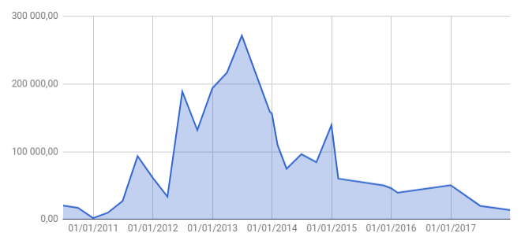
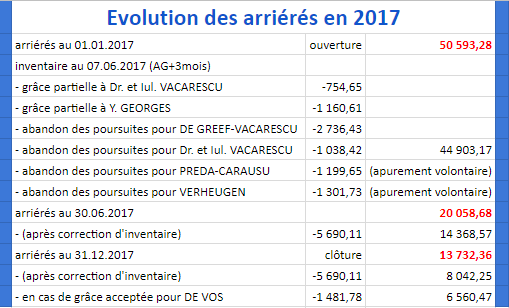
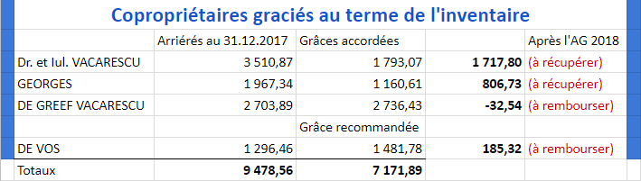

<link rel="stylesheet" href="normal4.css">

# Arriérés de charges

&Agrave; la clôture du dernier exercice pour lequel la *SA Regimo NV* avait obtenu décharge (31.12.2010), les arriérés de charges n'étaient que de 2.004,91 &euro;.

Au terme de la gestion de la *SA Regimo NV*, soit au 30.06.2013, les arriérés ont culminé à 271.526,94 &euro; (soit **191% des charges appelées** pour le 2ème trimestre 2013).

La "balance copropriétaires" communiquée par les services comptables du Syndic (le 22.01.2018 10h36) permet d'établir que le volume des arriérés de charges au 31.12.2017 a été ramené à **13.732,36 &euro;** (contre 50.593,28 &euro; à l'ouverture de l'exercice comptable).

| **Historique des arriérés en un coup d'&oelig;il** |
| :---: |
|  |

Au 30.06.2017, les arriérés de charges communiqués par le Syndic (le 27.07.2017 16h57) étaient pointés à 20.058,68 &euro;.  
Toutefois, cette somme ne tenait pas compte des [grâces partielles](https://sites.google.com/site/brab80invent2016/rectification-de-charges-de-coproprietaires-individuels) et [abandons de poursuites](https://sites.google.com/site/brab80invent2016/abandon-des-poursuites-aupres-des-debiteurs) accordés au terme de l'inventaire communiqué à l'AG du 07.03.2017.

> Compte tenu de la renonciation des copropriétaires PREDA-CARAUSU et VERHEUGEN à en bénéficier, un montant de 5.690,11 &euro; représentant ces grâces et abandons de poursuite.

Il est recommandé par ailleurs dans le cadre de ce rapport d'ajouter à cette somme une [grâce de 1.481,78 &euro;](Inventaire.md) pour le copropriétaire DE VOS.

Le tableau de fin d'exercice se présente donc comme suit :

| **Arriérés de charges. Exercice 2017** |
| :---: |
|  |

Tout dans tout, compte tenu de l'inventaire (non contesté dans les trois mois de l'AG du 07.03.2017), il ne reste donc plus que <b><u>6.560,47 &euro;</u> de charges en souffrance</b>.

> Parmi les succès rencontrés par l'avocat au cours de l'année 2017, il convient de relever l'extinction des dettes des copropriétaires REMICHE, HANNA ISSA et VELKOV-STOYANOVA.

Afin de guider le Syndic (comptabilisation) et l'avocat (pour ce qui est des poursuites) pour les bénéficiaires de grâces au terme de l'inventaire, le tableau suivant est établi :

| **Cas des copropriétaires graciés (inventaire)** |
| :---: |
|  |

