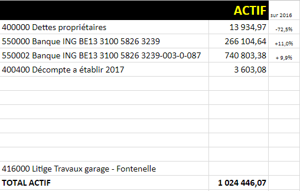

<link rel="stylesheet" href="normal4.css">

# Bilan dressé au 31 décembre 2017

### Passif

On note une augmentation de **9,9 %** du [Fonds de réserve](Fds_reserve.md) par rapport au bilan au 31.12.2016, approuvé par l'Assemblée générale du 07.03.2017.

### Actif

On note une réduction de près des 3/4 des [arriérés de charges](Arrieres.md) par rapport au bilan au 31.12.2016, approuvé par l'Assemblée générale du 07.03.2017.

On note également une augmentation des liquidités (+ 11%) pour honorer les factures présentés par les fournisseurs : le niveau du Fonds de roulement, tel qu'appelé en fonction du budget voté par l'Assemblée générale du 07.03.2017, s'est donc avéré suffisant.