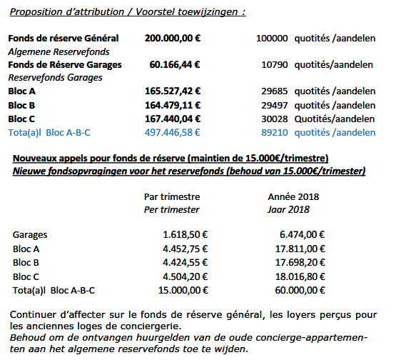

<link rel="stylesheet" href="normal4.css">

# Fonds de réserve

### Niveau atteint

| au 31.12.2016 | au 31.12.2017 | &nbsp; |
| ---: | ---: | --- |
| 674.206,12 &euro; | 740.803,38 &euro; | + 9,88 % |

&Agrave; la clôture du dernier exercice pour lequel la *SA Regimo NV* avait obtenu décharge, le Fonds de réserve s'élévait à 324.185,94 &euro;.

Au moment de la transition entre syndics (30.06.2013), le Fonds de réserve s'élevait à 417.967,18 &euro;

### Couverture par des comptes financiers

La 5° mission légale du syndic consiste à "*'administrer les fonds de l'association des copropriétaires; dans la mesure du possible, ces fonds doivent être intégralement placés sur divers comptes, dont obligatoirement un compte distinct pour le fonds de roulement et un compte distinct pour le fonds de réserve; tous ces comptes doivent être ouverts au nom de l'association des copropriétaires*" (art. 577-8 §4 Code Civil)

Au 31.12.2017, le syndic a respecté cette mission.

### Le Fonds de réserve est-il trop gros ?

Par leur courriel du 13.02.2017 (09h54), les services comptables du Syndic m'ont demandé ce que je pensais de la proposition telle que rédigée sous le Point 8.2 de l'ordre du jour de l'AG 2018.

En tant que Commissaire aux comptes, je n'ai pas émis d'objection. 

J'invite néanmoins les copropriétaires à examiner le `pour` et le `contre` de cette allocation nouvelle, en fonction de leurs anticipations de travaux de rénovation et/ou d'embellissement des différentes parties de l'immeuble (sous-sols, façades, ascenseurs, ...)

Il est rappelé que pour faire face à ses risques et ses charges futurs (quelquefois aléatoires), une ACP doit s'auto-financer. Ce qui implique qu'elle doit pouvoir disposer de fonds de réserve (général et/ou spécifiques à tel ou tel chantier ou projet) suffisamment alimentés par rapport à la planification pluriannuelle des travaux.

> Pour aboutir à une telle <u>programmation pluriannuelle</u> permettant d'ajuster les propositions budgétaires et les appels de fonds, le Syndic gagnerait à <u>consulter régulièrement le conseil de copropriété</u>, de telle manière à ce que celui-ci puisse, au moyen du rapport semestriel écrit auquel il est tenu, préparer les esprits bien en amont des AG 2019 et suivantes.

